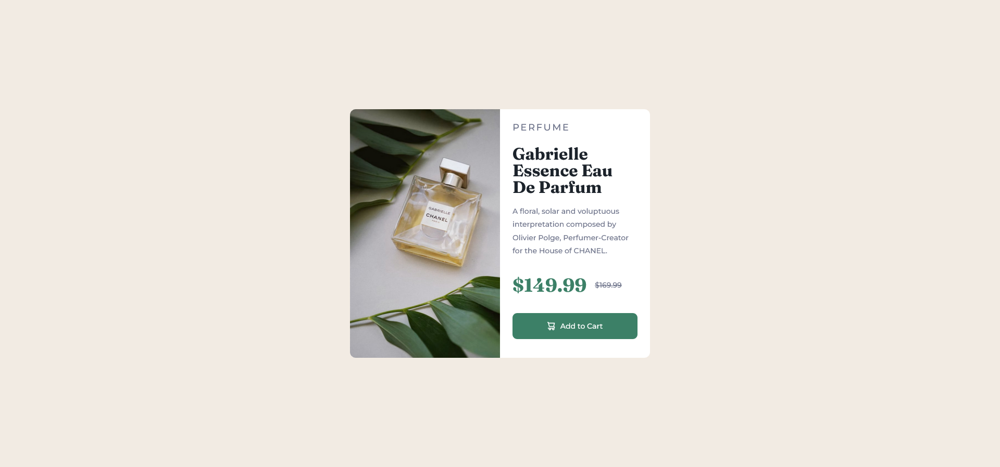
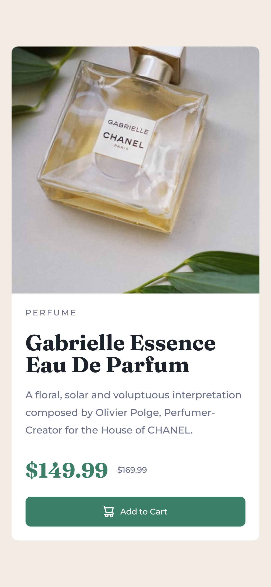

# Frontend Mentor - Product preview card component solution

This is a solution to the [Product preview card component challenge on Frontend Mentor](https://www.frontendmentor.io/challenges/product-preview-card-component-GO7UmttRfa). Frontend Mentor challenges help you improve your coding skills by building realistic projects. 

## Table of contents

  - [The challenge](#the-challenge)
  - [Screenshot](#screenshot)
  - [Links](#links)
- [My process](#my-process)
  - [Built with](#built-with)
  - [What I learned](#what-i-learned)
  - [Continued development](#continued-development)
- [Author](#author)

### The challenge

Users should be able to:

- Only did Desktop & 375px Media Queries.
- See hover and focus states for interactive elements

### Screenshot

### Links

- Solution URL: [solution](https://github.com/agmonster08/FEM-Card-Component.git)
- Live Site URL: [Add live site URL here](https://your-live-site-url.com)

## My process
-Do the mark up first
-Do typography & Font size, Weight
-select where to use CSS Grid and FlexBox
-Add spacing such as margin and padding.
-Finally colors & ser media queries for mobile.

### Built with

- CSS custom properties
- Flexbox
- CSS Grid

### What I learned

Learned how to properly place the image, for mobile. That was the most challenging part as i couldn't get the alignment correctly for the pictures,
also the margins outside for the background of the card.

### Continued development
Would like to get the dimensions for mobile better would surely update it. 
my next step would be to do a component that's more complicated to use CSS Grid columns & grid tracks.

## Author

- Website - [Github](ttps://github.com/agmonster08)
- Frontend Mentor - [@agmonster08](https://www.frontendmentor.io/profile/agmonster08)

